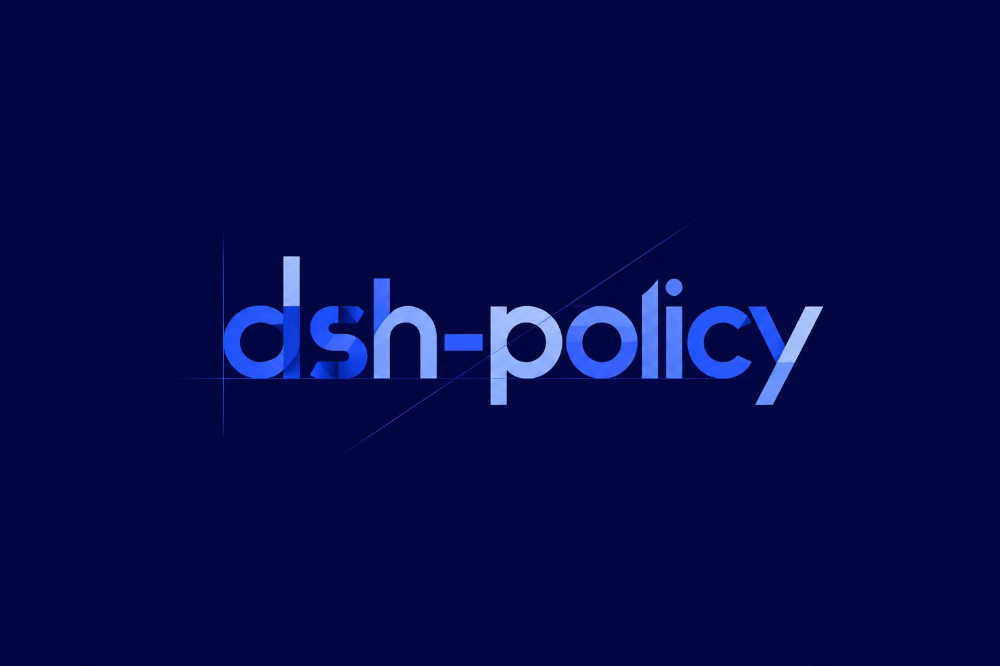
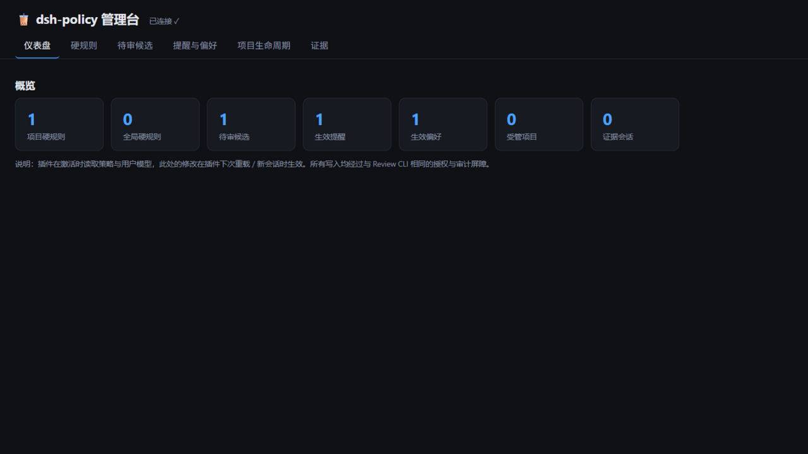
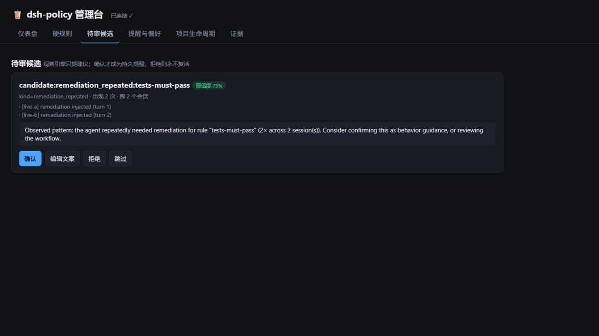

# dsh-policy

<p align="center">
  
</p>

<p align="center">
  <a href="https://github.com/x7687315-gif/dsh-policy/actions/workflows/ci.yml"></a>
  
  
  
  
  <a href="https://github.com/x7687315-gif/dsh-policy/issues"></a>
</p>

**User-controlled policy & personalization runtime for [DeepSeek Harness](https://github.com/deepseek-ai/deepseek-harness).**

A policy-driven runtime extension that lets users define project-level **hard constraints** (MUST / MUST NOT / BLOCK), manage behavioral guidance and coding preferences, and incrementally build a user-controlled personalization system — **without giving the AI autonomous authority over long-term user rules**.

> The system is not merely telling the Agent what to do. It is enforcing what the Agent is allowed to finish.

## What the plugin actually does

dsh-policy hooks into four verified DeepSeek Harness seams and turns your policy file into runtime enforcement:

```
Agent edits code          ──► tools/post-execute ──► normalized evidence (real tool results)
Agent calls a MUST NOT tool ─► tools/pre-execute ───► DENIED before the tool body runs
Agent says "done"         ──► agent/turn-stopping ──► evaluate hard rules
        violated, budget left                        ► BLOCK: remediation injected as a user message
                                                       (the loop re-opens the turn — the model must act)
        budget exhausted                             ► the turn can only end as an ERROR (never a fake completion)
        all rules pass                               ► the turn completes normally
```

Subsystems behind that pipeline:

| Subsystem | What it does | Where it hooks |
|---|---|---|
| **Policy loader & validator** | Reads `.dsh-policy/policy.json`, fails loudly on anything malformed (including bad regexes) | activation |
| **Scope resolver** | Merges global / project / task rules; enforces Constraint Monotonicity (specific scopes may ADD rules, never weaken stronger ones) | activation |
| **Constraint engine** | Pure function `evaluate(rules, evidence) → PASS \| BLOCK + remediation`; fail-closed | `agent/turn-stopping` |
| **MUST NOT gate** | Forbidden tools are denied before their body executes | `tools/pre-execute` |
| **Evidence store** | Per-session JSONL of real tool results; survives restarts (an unremediated violation keeps blocking) | `tools/post-execute` |
| **Behavior observation** | Detects recurring patterns (repeated remediations, denied-tool retries, user corrections) — zero extra LLM calls; candidates NEVER become rules without user review | `session/event` + enforcement actions |
| **Behavior Guard** | User-confirmed, contextual, NEVER-blocking reminders (type-isolated from hard rules) | prompt layer 910 + `post-execute` context |
| **User Model + 🧋 Review** | Durable personalization with a single write path (`ConfirmRequest`), full audit trail, interactive review CLI | CLI (the only writer) |
| **Context Resolver** | Injects only task-relevant preferences/goals under a hard 800-token budget; hard rules are never evicted | prompt layers 920/925 |
| **Project lifecycle** | Paused/completed/archived projects stop contributing rules | activation (registry) |

Verification baseline: **166/166 tests** across 25 files, benchmarked end-to-end (see [docs/benchmarks.md](docs/benchmarks.md)), a local **web management UI** (`pnpm ui`), and packaging tests that run against the built `dist/` bundle.

## Screenshots

The bundled web management UI (`pnpm ui` / `dsh-policy ui`) — localhost-only, point-and-click instead of config-file editing:

**Dashboard — everything at a glance**

<p align="center">
  
</p>

**Behavior review — confirm / edit / reject observed patterns (evidence + confidence shown)**

<p align="center">
  
</p>

## Why

Most "memory plugins" put more user information into a prompt. This project is different: the Agent operates inside a **user-controlled policy boundary** with three layers:

| Layer | Semantics | Can block the Agent |
|---|---|---|
| 1. Project Policy (hard constraints) | `MUST` / `MUST NOT` / `BLOCK`, machine-verifiable | **Yes** |
| 2. Behavior Guard (recurring mistakes) | `WARNING` / `GUIDE` | No |
| 3. Coding Preference (style/habits) | `PREFER` / `SOFT` | No |

Priority: **Hard Project Policy > Behavioral Guidance > Coding Preference**.

Core invariants:

- **AI suggestion is not user authorization.** The AI may observe and suggest, but never silently creates/modifies/deletes durable rules.
- **Runtime truth beats model claims.** Hard rules are verified from observable tool/session events, not from the LLM saying "I did it".
- **Constraint Monotonicity.** Specific rules may add requirements but never silently weaken stronger hard rules.

It is implemented as a **native DeepSeek Harness plugin** (Cordis), not a second agent framework.

## Installation

> **Note:** the package is not yet published to npm. Until then, install from GitHub or a local checkout (see below); once published it will be `pnpm add dsh-policy`.

### 1. Add the dependency & scaffold

```bash
# from GitHub (pin a commit/tag for reproducibility)
pnpm add github:x7687315-gif/dsh-policy

# or from a local checkout
pnpm add ./path/to/dsh-policy
```

Then scaffold your first policy with the bundled CLI (never overwrites an existing file):

```bash
npx dsh-policy init            # creates .dsh-policy/policy.json with a working starter rule
```

Requirements: Node ≥ 20, pnpm (or npm/yarn), and a DeepSeek Harness runtime with the Cordis loader.

### 2a. Wire it into your Harness via `cordis.yml` (recommended)

```yaml
plugins:
  # your LLM adapter — the API key comes from the environment, never a file
  - name: '@deepseek-ai/dsh-llm-deepseek'
    options:
      apiKey: ${DEEPSEEK_API_KEY}
      model: deepseek-chat
      baseURL: https://api.deepseek.com

  - name: dsh-policy
    options:
      policyPath: .dsh-policy/policy.json   # your project's hard rules
      userModelPath: ~/.dsh-policy/user-model.json
      behavior:
        enabled: true                       # opt-in pattern observation
      context:
        tokenBudget: 800                    # prompt budget for guidance/preferences
      projectId: my-project                 # enables the lifecycle registry
```

A complete production example lives at [`examples/cordis.yml`](examples/cordis.yml).

### 2b. Or mount it programmatically

```ts
import { dshPolicy } from 'dsh-policy'

await ctx.plugin(dshPolicy, {
  policyPath: '.dsh-policy/policy.json',
  behavior: { enabled: true },
})
```

### 3. Write your first policy

Create `.dsh-policy/policy.json` in your project:

```json
{
  "project": "my-api",
  "policy": {
    "hard": [
      { "id": "test-after-code-change", "trigger": "code_change", "require": "tests_pass", "enforcement": "hard" },
      { "id": "no-dangerous-commands", "trigger": "always", "denyTools": ["drop_database"], "enforcement": "hard" }
    ]
  }
}
```

The full schema (tool-pass rules, deny rules, evidence matchers, scopes, remediation text) is documented in **[docs/policy.md](docs/policy.md)**.

### Plugin options

| Option | Default | Purpose |
|---|---|---|
| `policy` / `policyPath` | `<cwd>/.dsh-policy/policy.json` | Project hard rules (inline wins over path) |
| `globalPolicy` / `globalPolicyPath` | `~/.dsh-policy/policy.json` | Cross-project hard rules |
| `taskRules` | — | Additive-only task-scope rules |
| `projectId` / `projectRegistryPath` | `~/.dsh-policy/project-registry.json` | Lifecycle: paused/archived projects stop enforcing |
| `maxRemediations` | `2` | Injected remediations per turn before hard refusal |
| `evidenceRoot` | in-memory | Directory for durable per-session JSONL evidence |
| `behavior` | disabled | Pattern observation (writes candidates for review, never rules) |
| `userModelPath` | — | Read-only consumption of confirmed guards/preferences |
| `guards` / `preferences` / `goals` | — | Inline overrides of the user-model projections |
| `context.tokenBudget` | `800` | Prompt budget for guidance/preferences (hard rules never evicted) |

## Running things

The unified CLI (installed as `dsh-policy` via the `bin` entry, or from the repo):

```bash
dsh-policy init      # scaffold .dsh-policy/policy.json (never overwrites)
dsh-policy review    # interactive/piped candidate review
dsh-policy project   # lifecycle: pause | resume | complete | archive
dsh-policy ui        # local web management UI -> http://127.0.0.1:5178
```

From a repo checkout, the same commands work via pnpm scripts (`pnpm ui`, `pnpm review`, `pnpm project`, `pnpm init`) plus:

```bash
pnpm install
pnpm test        # 166 tests / 25 files — real Harness stack, scripted LLM (no API key needed)
pnpm bench       # full benchmark sweep -> bench/report.json (constraint/personalization/cost)
pnpm demo        # end-to-end: BLOCK -> remediation injected -> tests run -> PASS
pnpm typecheck   # strict TS, zero errors
pnpm build       # tsdown -> dist/ (npm-publishable bundle, verified by packaging tests)
```

### 🖥️ Web management UI — point-and-click management

```bash
pnpm ui --policy .dsh-policy/policy.json --candidates <behaviorRoot> --model ~/.dsh-policy/user-model.json
# open http://127.0.0.1:5178  (localhost only)
```

Six tabs, no configuration file editing required:

- **Dashboard** — counts of rules, pending candidates, active guards/preferences, projects, evidence sessions
- **Hard rules** — add/edit/enable/disable tool-pass and MUST-NOT rules across project & global scopes; every save is server-side validated (invalid rules — including bad regexes — never reach disk)
- **Candidates** — review observed patterns with evidence & confidence: confirm / edit the message / reject (tombstoned forever) / skip
- **Guards & preferences** — manage durable user-model records with enable/disable/delete (all audited), add preferences with `appliesTo` conditions
- **Project lifecycle** — pause/resume/complete projects
- **Evidence** — read-only per-session JSONL viewer

Write-path discipline holds in the UI: it is the second legitimate writer (after the Review CLI), every mutation is an explicit user action flowing through `ConfirmRequest{via:'review-ui'}` + audit; the plugin stays read-only and picks changes up at its next activation.

### 🧋 Review CLI — confirm or reject behavior candidates

Observation produces **candidates**; only you make them durable:

```bash
pnpm tsx src/review/cli.ts --candidates <behaviorRoot> --model ~/.dsh-policy/user-model.json
```

For each candidate it shows the evidence, occurrence counts and confidence, then asks:
`[y] confirm / [e <msg>] edit / [n] reject / [s] skip`. Confirmed candidates become
Behavior Guards on the next activation; rejected ones are tombstoned and never resurface.
The CLI is the ONLY writer of the user model, and every change is audited.

### Project lifecycle CLI

```bash
pnpm project pause <projectId>     # rules stop contributing to new sessions
pnpm project resume <projectId>
pnpm project complete <projectId>
pnpm project archive <projectId>   # .dsh-policy moved to archive/, history kept
```

### Production run

1. `export DEEPSEEK_API_KEY=...` (never commit keys),
2. start your Harness with [`examples/cordis.yml`](examples/cordis.yml),
3. the plugin loads your policy, tells the model the rules in its prompt, and enforces them at the turn boundary — no local inference, all LLM calls go to the DeepSeek cloud API.

### Enforcement behavior at a glance

```
Agent edits code                     → tools/post-execute records code_change (real tool result)
Agent says "done" without tests      → agent/turn-stopping evaluates the policy
                                     → BLOCK: remediation injected as a user message
Agent runs tests, tests fail again   → BLOCK again (within the remediation budget)
Budget exhausted while still violated → the turn can only end as an error (never a fake completion)
Agent runs tests, tests pass         → PASS: the turn may complete
Agent calls a MUST NOT tool          → tools/pre-execute denies the call before the body runs
Every step                           → the model sees the active rules in its prompt (explanation ≠ enforcement)
```

## Status

**Stage 0–18 complete — the full project plan (Phase 0–18) plus the web management UI and real-environment hardening.** Verification baseline: `pnpm test` **166/166** across 25 files, `pnpm typecheck` clean, `pnpm build` green, `pnpm bench` full-sweep benchmark green ([report](bench/report.json), [interpretation](docs/benchmarks.md)).

- [x] Stage 0 — repository foundation
- [x] Stage 1 — Harness integration verification (turn-stopping blocking mechanism confirmed)
- [x] Stage 2 — policy & constraint engine core
- [x] Stage 3 — hard-constraint proof of concept (`code_change → tests_pass`)
- [x] Stage 4 — documentation & wrap-up
- [x] Stage 5 — generalized rule model + Constraint Monotonicity
- [x] Stage 6 — MUST NOT gate (`tools/pre-execute` deny) + rule visibility in the prompt
- [x] Stage 7 — CI (GitHub Actions) and docs sync
- [x] Stage 8 — durable session evidence, HMR safety, publishable build
- [x] Stage 9 — defect review (per-turn budget, root cleanup, strict deny trigger)
- [x] Stage 10 — behavior observation engine (zero extra LLM calls)
- [x] Stage 11 — Behavior Guard (contextual, never-blocking guidance)
- [x] Stage 12 — User Model + 🧋 Review pipeline & CLI (single write path + audit)
- [x] Audit — L1/L2 security audit: soft layers cannot gain BLOCK or bypass authorization
- [x] Hardening — R1 regex fail-fast + R2 fail-closed turn gate
- [x] Stage 13 — preference layer & Context Resolver (token budget, relevance, order 920)
- [x] Stage 14 — scopes (global/project/task) + lifecycle registry & CLI
- [x] Stage 15 — full composition: goal model, `cordis.yml`, scenarios A–E end-to-end
- [x] Stage 16 — benchmarks: constraint effectiveness / personalization effectiveness / cost
- [x] Stage 17 — web management UI (out-of-plan enhancement): point-and-click management of rules, candidates, guards, preferences, lifecycle
- [x] Stage 18 — real-environment verification (dist bundle, discovery semantics, real-browser UI test) + install simplification (`dsh-policy init` / unified CLI / bin entry)

Next: **hardening & deployment** — npm publish, cloud smoke test (DeepSeek key), registered engineering debts (see [docs/PROGRESS.md](docs/PROGRESS.md)).

## Engineering reports — everything we did, stage by stage

Each stage below has a full report (what was done, how, and where the project stood afterwards). Start with the [project plan](docs/project-plan.md) (the original specification) and the [stage table](docs/PROGRESS.md) (current status), then dive into any stage:

**Foundation**

- [Stage 0 — 仓库奠基](docs/stages/stage-0-仓库奠基.md) — scaffold, doc system, GitHub repo
- [Stage 1 — Harness 接入验证](docs/stages/stage-1-harness接入验证.md) — real extension APIs verified, turn-stopping mechanism confirmed
- [Stage 2 — 策略与引擎核心](docs/stages/stage-2-策略与引擎核心.md) — schema / validator / loader / evidence / pure engine
- [Stage 3 — POC 集成测试](docs/stages/stage-3-POC集成测试.md) — the four cases proving an agent cannot finish while violating the policy
- [Stage 4 — 收尾同步](docs/stages/stage-4-收尾同步.md)

**Generalization**

- [Stage 5 — 规则模型泛化](docs/stages/stage-5-规则模型泛化.md) — two rule kinds, scope resolution, Constraint Monotonicity
- [Stage 6 — MUST NOT 门禁与规则可见性](docs/stages/stage-6-MUST-NOT门禁与规则可见性.md) — pre-execute deny gate, prompt layers, root-scope finding
- [Stage 7 — CI](docs/PROGRESS.md) — GitHub Actions (typecheck + tests on push/PR)
- [Stage 8 — 持久化与 HMR 安全](docs/stages/stage-8-持久化与HMR安全.md) — per-session JSONL evidence, restart survival, policy authoring guide
- [Stage 9 — 缺陷审查与修复](docs/stages/stage-9-缺陷审查与修复.md) — per-turn budget, root-registration cleanup, strict deny trigger

**Personalization**

- [Stage 10 — 行为观察引擎](docs/stages/stage-10-行为观察引擎.md) — deterministic patterns, confidence formula, rejection tombstones
- [Stage 11 — Behavior Guard](docs/stages/stage-11-BehaviorGuard.md) — contextual never-blocking guidance, type-isolation invariant
- [Stage 12 — User Model 与 Review](docs/stages/stage-12-UserModel与Review.md) — single write path + audit + 🧋 CLI (interactive/piped)
- [Security audit — L1/L2 架构安全审计](docs/stages/stage-audit-L1L2-架构安全审计.md) — soft layers cannot gain BLOCK or bypass authorization
- [Hardening — R1/R2](docs/stages/stage-fix-R1R2-正则校验与失败闭合.md) — regex fail-fast + fail-closed turn gate

**Composition & verification**

- [Stage 13 — 偏好层与 Context Resolver](docs/stages/stage-13-偏好层与ContextResolver.md) — relevance matching, 800-token budget, order 920
- [Stage 14 — 作用域与生命周期](docs/stages/stage-14-作用域与生命周期.md) — global/project/task scopes, lifecycle registry & CLI
- [Stage 15 — 全量集成与端到端验收](docs/stages/stage-15-全量集成与端到端验收.md) — goal model, cordis.yml, scenarios A–E
- [Stage 16 — 基准测试](docs/stages/stage-16-基准测试.md) — three-dimension benchmark + the P1 defect it caught
- [Review round — 一致性/全局性/安全性审查](docs/stages/stage-review-一致性全局性安全性.md) — cross-cutting defect review
- [Stage 17 — Web 管理界面](docs/stages/stage-17-Web管理界面.md) — out-of-plan enhancement: point-and-click management UI (planned extra)
- [Stage 18 — 真实环境验证与安装简化](docs/stages/stage-18-真实环境验证与安装简化.md) — dist packaging tests, discovery semantics, real-browser UI verification, `dsh-policy init`

**Reference documents**

- [docs/architecture.md](docs/architecture.md) — verified Harness extension seams & findings
- [docs/policy.md](docs/policy.md) — how to write a policy file
- [docs/benchmarks.md](docs/benchmarks.md) — benchmark interpretation
- [docs/roadmap.md](docs/roadmap.md) — technical plans for every stage
- [docs/PROGRESS.md](docs/PROGRESS.md) — the live stage table & commit log

## Community

dsh-policy is part of the DeepSeek Harness plugin ecosystem ("Everything is a Plugin") — find it (and siblings) via the GitHub topics [`dsh`](https://github.com/topics/dsh) and [`dsh-plugin`](https://github.com/topics/dsh-plugin).

- 🐛 Found a bug or want a feature? [Open an issue](https://github.com/x7687315-gif/dsh-policy/issues)
- 🔀 PRs welcome — small, testable, explainable changes (see the plan's contribution philosophy)
- 🧋 Feedback on the beta is especially valuable: does the three-layer model map to how YOU want to constrain your agents?

## License

[MIT](LICENSE)
